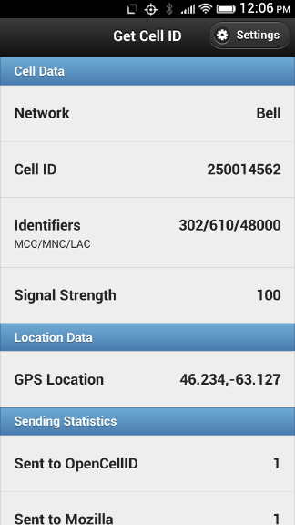

Get Cell ID
===========

This is an open web app, targetted at Firefox OS and tested initially on the Geeksphone Peak, that grabs the current cellular network ID (the MCC, MNC, LAC and Cell ID) and displays them.

The app will also, optionally, upload this information to  [OpenCellID.org](http://opencellid.org), [Mozilla Location Services](https://location.services.mozilla.com/) and/or a custom URL.

How to Install
--------------

1. Connect your device via USB to a computer running Firefox and the [Firefox OS Simulator](https://addons.mozilla.org/en-US/firefox/addon/firefox-os-simulator/).
2. Clone the repository to your local machine.
3. From the [Firefox OS Simulator](https://addons.mozilla.org/en-US/firefox/addon/firefox-os-simulator/), click **Add Directory** and locate the manifest.webapp you just cloned.
4. Push the app to your device ([more details here](https://marketplace.firefox.com/developers/docs/firefox_os_simulator)).

Note about GPS
--------------

For the app to send geolocation reports to [OpenCellID.org](http://opencellid.org), [Mozilla Location Services](https://location.services.mozilla.com/) or a custom URL obviously requires the device to know its geolocation using GPS.

You may find that your device, even though equipped with a GPS, takes a really long time to return location [this Mozilla Hacks post can shed some light on this](https://hacks.mozilla.org/2013/10/who-moved-my-geolocation/). While the device is waiting to obtain a GPS postion, reports will not be sent and "Finding" will appear in the GPS Location field.

Eventually, once a GPS geolocation is determined, reports will automatically start to flow.

How to Configure
----------------

Once the app is running, it should, as long as you have a SIM card in your device, immediately display your network, Cell ID and LAC, MCC and MNC information.

### Mozilla Location Services Updates

To configure reporting to Mozilla Location Services doesn't require an API key at present; you can, however, enter an optional "Nickname" and you will then find that your reports appear on the [Leaderboard](https://location.services.mozilla.com/leaders) credited to you.

### OpenCellID Updates

To configure reporting to OpenCellID.org, you will need a free API key, which you can [request here](http://opencellid.org/#&action=database.requestForApiKey). Once you have the API key, click on the Settings icon in the top left, check the "Send to OpenCellID.org" checkbox, and type the API key into the field beneath. 

*If you signed up for an API key before the migration of OpenCellID to [ENAiKOON](https://www.enaikoon.com/) it appears that your key will continue to work without a need for update.*

### Custom URL Updates

To configure reporting to a custom URL of your choosing, enter the full URL.  The app will report to this URL using the [same parameters are OpenCellID.org](http://opencellid.org/api). Here's a small PHP script that you can use to parse and log these reports to a TSV file:

	<?php
	$fp = fopen("/data/getcellid/getcellid.log","a");
	fwrite($fp,$_GET['measured_at'] . "\t");
	fwrite($fp,$_GET['cellid'] . "\t");
	fwrite($fp,$_GET['lac'] . "\t");
	fwrite($fp,$_GET['mcc'] . "\t");
	fwrite($fp,$_GET['mnc'] . "\t");
	fwrite($fp,$_GET['signal'] . "\t");
	fwrite($fp,$_GET['lat'] . "\t");
	fwrite($fp,$_GET['lon'] . "\n");
	fclose($fp);

### Adjusting Update Frequency

You can then adjust the update frequency for uploading data to the networks you have enable to a figure between once-every-5-seconds and once-every-30-minutes. 

Save the settings and the device will request permission to access the GPS. Wait for a GPS position to be discovered (this can take anywhere from 10 seconds to 12 minutes depending on whether you have A-GPS enabled); you'll see the latitude and longitude on the main app screen once it has been obtained, and the app will start sending updates.

Is it working?
--------------

To confirm that your reports are getting to OpenCellID.org, in a desktop browser visit:

	http://www.opencellid.org/measure/list?key=myApiKey&format=xml

where **myApiKey** is the same API key you use for the app. If it's working, you should see a list of your reports, like:

	<rsp stat="ok">
		<measure id="52a24f27e4b0864499c722f5" lat="46.23813682" lon="-63.1251563" mcc="302" mnc="262" lac="48000" cellid="2400123" created_at="1385039978000" measured_at="1385021974000" signal="77" rating="0" speed="0" direction="0"/>
		<measure id="52a24f27e4b0864499c72329" lat="46.23801264" lon="-63.12450342" mcc="302" mnc="262" lac="48000" cellid="2414710" created_at="1385040019000" measured_at="1385022016000" signal="100" rating="0" speed="0" direction="0"/>
	</rsp>

Data Usage
----------

In my testing (using the "Usage" app on my Geeksphone Peak), the app uses data as follows:

* initial A-GPS call: 1.42KB
* every OpenCellID.org update: 2.13KB

This means that if you leave the app set at the default update frequency of 30 seconds, and left it running all day, the app would update 2,880 times and consume 6134KB (about 6MB) of data. If you set the update frequency to 5 minutes, the app will update 288 times a day and consume 613KB.

To Do
-----

* Handle failure, especially of the OpenCellID.org update, more gracefully (or, indeed, at all), and perhaps check the OpenCellID.org key for validity when it's saved on the "Settings" page.
* Make the Cell ID "clickable", generating a query to the OpenCellID.org API that accepts a Cell ID and returns its guess of geolocation.
* Make the use of the GPS smarter: if the device is idle on a bedstand overnight there's no need to leave the GPS on when this app is running, as it will just run the battery down. So perhaps use the cell ID itself, and/or the accelerometer, to detect a change in position and turn on the GPS only when we need it.

Limitations
-----------

Getting cell ID information requires using the [Mobile Connection API](https://developer.mozilla.org/en-US/docs/WebAPI/Mobile_Connection), which requires the **mobileconnection** permission in the manfest, which, in turn, requires that the app be "certified" to be available in the Firefox Marketplace (or, indeed, to be made available as a user-installable packaged app). So, as things are now, this app's distribution will be difficult.

Sources
-------

* [jQuery](http://jquery.com/)
* [jQuery Mobile](http://jquerymobile.com/)
* [Moment.js](http://momentjs.com/)
* [Icon](http://vector.me/browse/195013/radio_wireless_tower_clip_art)

Screenshot
----------

